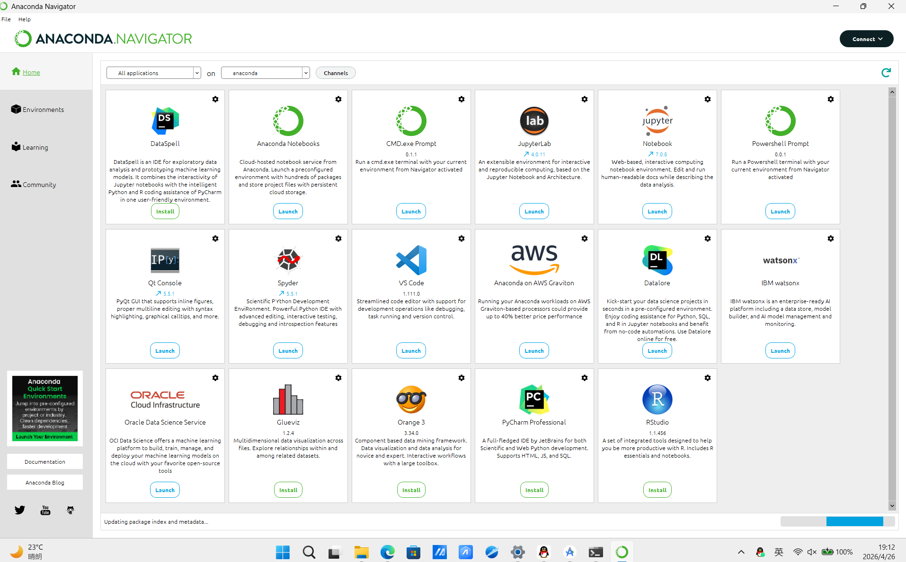
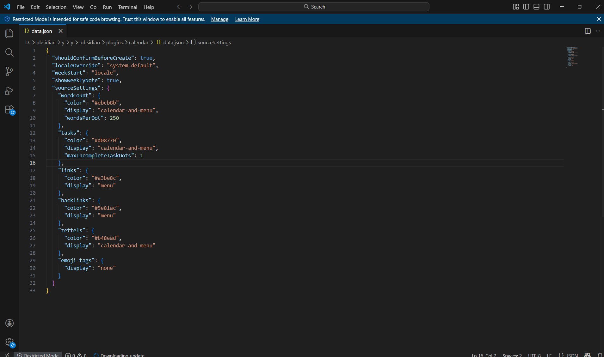
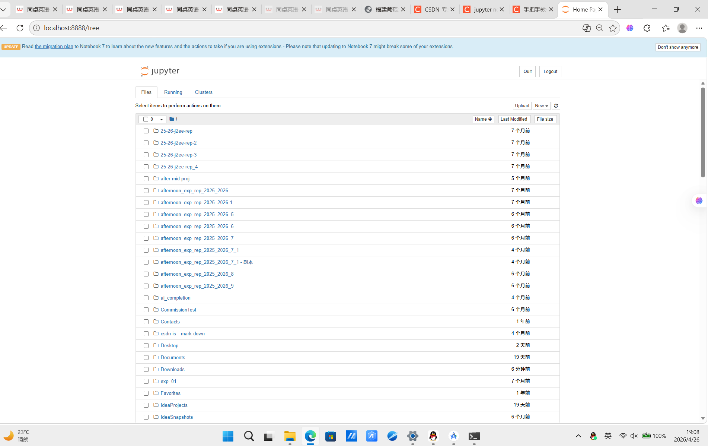
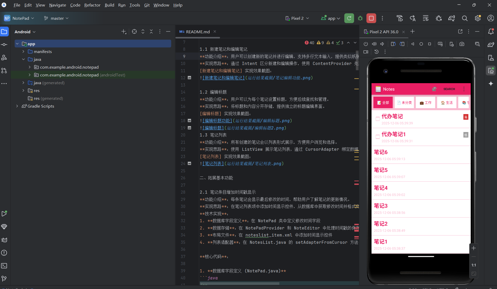

# sy1-install-task

一、Anaconda 安装与配置
1. 下载安装包
访问官网：https://www.anaconda.com/products/distribution#download-section

2. 安装步骤
双击运行 Anaconda 安装程序
许可协议：点击 I Agree 同意协议
安装类型：选择 Just Me (recommended) 仅当前用户使用
安装路径：自定义安装目录

高级选项设置：

✅ 勾选：Add Anaconda to my PATH environment variable（自动配置环境变量）

✅ 勾选：Register Anaconda as my default Python 3.xx

后续默认下一步，等待安装完成，点击 Finish

3. 验证安装

二、Visual Studio Code（VS Code）安装
1. 下载安装包
官网地址：https://code.visualstudio.com/
直接点击首页下载按钮，自动匹配系统版本

2. 安装流程
双击安装程序，进入安装向导
同意协议，选择安装路径

额外任务勾选（全部推荐勾选）：

✅ 将 “通过 Code 打开” 添加到文件资源管理器上下文菜单

✅ 将 “通过 Code 打开” 添加到目录上下文菜单

✅ 注册为受支持的文件类型的编辑器

✅ 添加到 PATH（重启后生效）

点击下一步，等待安装完成，启动 VS Code

三、Jupyter Notebook 安装与启动

前提：已完成 Anaconda 安装（Anaconda 自带 Jupyter，无需额外 pip 安装）
1. 启动方式
   
命令行启动

运行
jupyter notebook

自动跳转浏览器，进入 Jupyter 工作目录

四、Android Studio 安装与配置

1. 下载安装包
官网地址：https://developer.android.com/studio
下载 Android Studio 稳定版，免费社区版即可满足开发

2. 安装流程
双击安装包，进入安装向导，点击 Next

组件选择：默认勾选 Android Studio、Android SDK、Android Emulator

4. 首次初始化配置
启动软件，选择 Standard 标准配置（新手推荐）
确认 SDK 许可协议，全部同意
等待自动补全依赖文件，完成初始化

5. 创建首个项目（测试环境）
首页点击 New Project
选择模板：Empty Views Activity
自定义项目名称、包名，语言选择：Kotlin / Java
等待 Gradle 同步构建项目，构建完成代表环境正常

